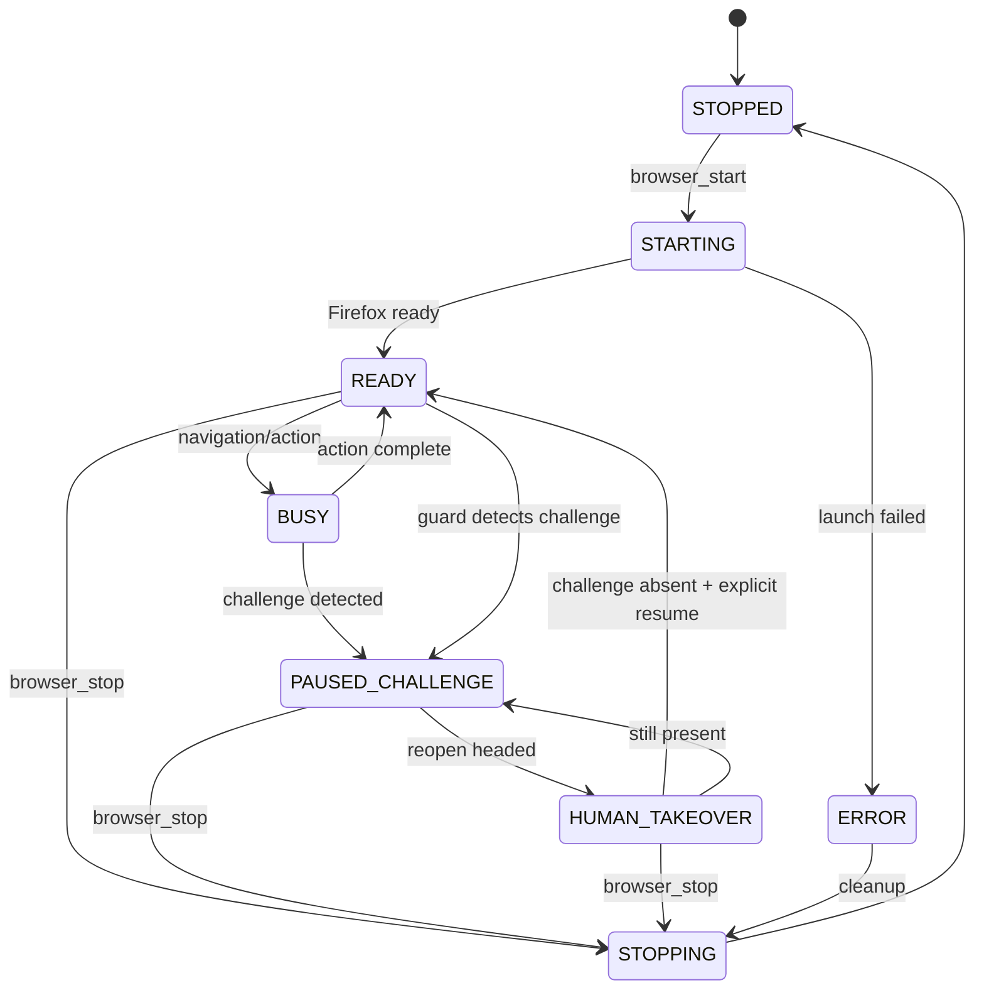

# 浏览器身份隔离与自动化 MCP 产品需求文档

> 当前仓库交付物：本地 Profile 隔离 Studio 与合规、受约束、可审计的 Firefox 自动化 MCP。Studio 已提供代理池轮换和声明式 RPA，但不提供挑战绕过、隐身承诺或规避平台风控的功能。

> 版本：v1.0  
> 日期：2026-08-30  
> 状态：开发基线  
> 产品定位：目标产品为传统反检测指纹浏览器；当前版本为合规、受约束、可审计的 Firefox 自动化 MCP。

## 1. 背景

Agent 需要在真实网页 UI 中完成导航、读取、点击、输入和截图，但直接开放浏览器底层协议、任意 JavaScript 或网络请求会放大误操作与安全风险。本产品以项目锁定的 Playwright Firefox（Gecko）兼容构建 + MCP 为基础，为自有网站、测试环境或获得明确授权的第三方网站提供高层浏览器动作。

“自然交互”在本产品中仅表示：鼠标通过若干中间点移动、键入按字符节奏执行、动作间有短暂且有上限的等待，并在页面变化后等待稳定。这些机制用于降低误点、演示突兀和 UI 竞态，不用于冒充人类、规避机器人检测或提高挑战通过率。

## 2. 目标与非目标

### 2.1 当前版本已交付目标


- 通过本地 stdio MCP 向 Agent 暴露 Firefox 会话能力；
- 支持 headless 和 headed 两种启动方式；
- 支持导航、读取、截图、查找、点击、输入、选择、滚动、等待等高层动作；
- 支持有界的自然节奏与可复现实验用随机种子；
- 检测 Cloudflare/Turnstile/CAPTCHA/机器人挑战后立即暂停自动操作；
- 支持在同一会话内保留现场并以 headed 模式交给人工；默认关闭时清理临时 Profile，管理员显式开启 `BROWSER_PERSIST_PROFILES=true` 后可在受保护数据卷中复用命名 Profile；
- 默认域名 allowlist、私网阻断、并发上限、超时与审计日志；
- 提供单元测试、MCP 契约测试和本地页面集成测试。

### 2.2 当前版本暂不交付


- 解决、点击、外包或绕过任何生产 CAPTCHA/Cloudflare 挑战；
- Firefox 定制内核、挑战求解或对第三方检测通过率的承诺；
- 住宅代理供应、按风控信号自动换身份、批量注册或账号养号；
- 凭据窃取或未授权的跨用户共享；Cookie 迁移仅限操作员管理的 Profile，并加密落盘；
- 任意 JavaScript `evaluate`、CDP/BiDi 原始命令、任意 HTTP 请求；
- 规避 robots.txt、网站条款、访问控制或速率限制。

## 3. 用户故事

### US-01 启动受控会话

作为 Agent 开发者，我希望以 headless/headed 模式启动 Firefox，并指定一个已授权的档案名，以便持续使用同一测试会话。

验收：未在 allowlist 中的域名仍不可访问；同名档案路径由服务端映射，调用方不能传任意文件路径。

### US-02 导航并读取页面

作为 QA，我希望打开 URL、获得标题/URL/可见文本摘要和链接列表，以验证页面内容。

验收：URL 在发起请求前和重定向后都做策略校验；私网、环回、链路本地和云元数据地址默认拒绝。

### US-03 稳定的语义交互

作为 Agent，我希望通过角色+名称、标签文本或测试 ID 指定目标，让服务端完成带节奏的点击和输入，而不是注入脚本。

验收：定位歧义时返回候选数量而不是任意选择；鼠标移动包含多个中间事件；每次动作都有最大耗时。

### US-04 挑战暂停与人工接管

作为运营人员，我希望出现机器人挑战时自动化立即停止，并能在有头 Firefox 中人工处理。

验收：挑战状态下只允许状态、语义快照、截图、有界等待、停止和打开人工接管；导航、点击、输入、选择与滚动全部拒绝；系统不主动与挑战控件交互；恢复前重新检测挑战已经消失。

### US-05 审计与排障

作为安全负责人，我希望知道谁在何时对哪个域名执行了什么动作、结果如何，但日志中没有密码或完整输入文本。

验收：日志为追加写 JSONL；输入类动作仅记录长度和字段描述；错误带稳定 code、sessionId、timestamp。

## 4. 核心流程



## 5. MCP 工具范围

工具命名使用 `browser_*` 与 `page_*` 前缀。MVP 不提供任意脚本工具。

| 工具 | 关键输入 | 结果摘要 | 风险注解 |
| --- | --- | --- | --- |
| `browser_start` | `headless`, `profile`, `viewport`, `seed?` | sessionId、状态 | 创建本地进程；`profile` 当前仅是临时目录标签，不代表持久登录态 |
| `browser_status` | `sessionId` | 状态、页面、挑战信息 | 只读 |
| `browser_stop` | `sessionId` | 已关闭/已清理 | 幂等 |
| `browser_reopen_headed` | `sessionId` | 人工接管状态 | 只允许挑战暂停状态 |
| `browser_resume` | `sessionId`, `humanConfirmed` | READY 或仍暂停 | 仍有挑战时拒绝恢复 |
| `browser_handoff` | `sessionId`, `ttlMs?`, `reason?` | USER_CONTROLLED、一次性 lease token | headed 人工控制期间全部自动化 hard-stop |
| `browser_takeover` | `sessionId`, `leaseToken`, `humanConfirmed` | READY 或仍暂停 | token/TTL 校验后重新检测挑战 |
| `page_open` | `sessionId`, `url` | 最终 URL、标题、状态 | 前后两次 URL 策略检查 |
| `page_snapshot` | `sessionId`, `maxChars?`, `sinceSnapshotId?` | 标题、URL、语义摘要或有界增量 | 只读、长度/历史容量限制 |
| `page_screenshot` | `sessionId`, `fullPage?` | 内嵌图像与不透明 `artifactRef` | 不接受也不返回主机路径 |
| `page_click` | `sessionId`, `target` | 实际匹配目标、耗时 | 挑战控件不可操作 |
| `page_type` | `sessionId`, `target`, `text`, `clear?`, `submit?` | 字符数、耗时 | 审计不记录正文 |
| `page_select` | `sessionId`, `target`, `value/label` | 选中值 | 语义定位 |
| `page_scroll` | `sessionId`, `direction/amount` | 新滚动位置 | 有界距离 |
| `page_wait` | `sessionId`, `milliseconds` 或安全条件 | 等待结果 | 最大等待上限 |
| `page_workflow` | `sessionId`, `steps`, `timeoutMs?` | 有界逐步结果和停止原因 | 按当前管理员策略限制（standard 默认最多 50 步，硬上限 100 步）；无循环、脚本、raw selector；执行期独占会话 |


### 5.1 Target schema

目标仅使用可访问性语义或服务端短期 opaque ref：

```json
{
  "role": "button",
  "name": "保存",
  "exact": true
}
```

或：

```json
{
  "label": "邮箱"
}
```

或：

```json
{
  "testId": "submit-order"
}
```

不提供 CSS、XPath、坐标、元素句柄或底层协议后备，也不允许定位 Cloudflare/Turnstile/CAPTCHA 元素。

## 6. 自然节奏需求

自然节奏由 `InteractionScheduler` 统一实现，避免各工具自行随机：

- 鼠标：从当前点到元素安全点击点，使用缓入缓出曲线和 8–24 个中间点；
- 点击前：默认 80–260 ms 的聚焦等待；
- 点击后：默认 120–450 ms，并等待短暂页面稳定；
- 输入：按字符 25–90 ms；换行、标点可有额外短停顿；
- 滚动：分段执行，单次总距离与总时长有上限；
- 所有随机值可通过 seed 复现；
- MCP 默认且仅公开 `paced` 有界节奏；`direct` 只是服务端注入的受信任回归测试调度器，两者都只调用 Locator 等高层 API；
- 不采集、拟合或回放真实个人的生物行为特征。

## 7. 挑战检测与处置

### 7.1 检测信号

只做保守检测，不尝试理解或破解挑战：

- 页面标题/可见文本出现常见验证提示；
- 存在 Cloudflare challenge/Turnstile iframe 或容器；
- URL/iframe 指向已知 challenge origin；
- 页面出现 CAPTCHA 通用标记；
- 导航后长时间停留在验证中间页。

### 7.2 处置规则

1. 将 session 状态原子切换为 `PAUSED_CHALLENGE`；
2. 记录挑战类型、URL、时间与脱敏截图；
3. 拒绝后续导航、点击、输入、选择和滚动；
4. 允许查询状态、语义快照、截图、有界等待、停止及打开人工接管；
5. 不点击 checkbox、不调用解题服务、不提取 token；
6. 仅在 headed 模式下由人完成站点要求；
7. `browser_resume` 重新检测页面，挑战仍存在则保持暂停。

## 8. 安全与合规要求

### 8.1 URL 策略

- `BROWSER_ALLOWED_HOSTS` 必填；为空时所有导航失败；
- 仅允许 `http:`/`https:`，生产建议仅 `https:`；
- 精确域名或显式 `*.example.com`，禁止宽泛 `*`；
- DNS 解析后阻断 loopback、private、link-local、multicast、reserved；
- 阻断 `169.254.169.254` 等云元数据地址；
- 每次重定向后的最终 URL 再校验；
- 测试时可显式 `BROWSER_ALLOW_PRIVATE_NETWORK=true`，但进程启动日志必须警告。

### 8.2 能力约束

- 不提供任意文件路径、shell、脚本执行、扩展安装或原始协议访问；
- 默认不允许下载与上传；未来若增加，必须单独审批并限制到服务端沙箱目录；
- MCP stdio 日志只写 stderr，stdout 保持协议纯净；
- 每个会话最多一个页面（MVP）；最多并发会话数由配置控制，默认 2；
- 单动作默认 15 秒、导航默认 30 秒、会话空闲 15 分钟回收；
- 关闭进程时保证 browser context、临时目录和锁被回收。

### 8.3 审计

每条 JSONL 至少包含：

```json
{
  "timestamp": "2026-08-30T09:00:00.000Z",
  "requestId": "req_...",
  "sessionId": "ses_...",
  "action": "page_click",
  "host": "admin.example.com",
  "target": { "role": "button", "name": "保存" },
  "outcome": "success",
  "durationMs": 482
}
```

输入正文、密码、Cookie、Authorization、页面完整 HTML 不写日志。URL query 默认移除。

## 9. 非功能需求

| 类别 | 要求 |
| --- | --- |
| 兼容性 | Windows 11 与 Linux；Node.js 20+；Playwright Firefox 当前固定版本 |
| 可靠性 | 100 次本地交互用例成功率 ≥ 98%；stop 幂等；异常退出无残留托管进程 |
| 性能 | MCP 状态查询 P95 < 100 ms；不含页面网络耗时的调度开销 P95 < 800 ms |
| 安全 | allowlist/私网策略单测 100%；无任意脚本与任意文件路径接口 |
| 可观测性 | 每次工具调用有 requestId、结构化错误与 JSONL 审计；可选调试截图 |
| 可维护性 | 核心策略、浏览器适配、MCP 注册相互解耦；关键模块覆盖率 ≥ 80% |

## 10. 结构化错误

| code | 含义 | Agent 建议动作 |
| --- | --- | --- |
| `SESSION_NOT_FOUND` | 会话不存在/已回收 | 重新启动 |
| `SESSION_BUSY` | 上一动作仍执行 | 稍后查询状态 |
| `SESSION_PAUSED_CHALLENGE` | 检测到挑战 | 请求人工接管或停止 |
| `NAVIGATION_DENIED` | URL 不在授权范围 | 不得重试；修改管理员配置 |
| `PRIVATE_NETWORK_DENIED` | 目标解析到受保护网络 | 不得重试 |
| `TARGET_NOT_FOUND` | 未找到目标 | 先 snapshot 后修正 target |
| `TARGET_AMBIGUOUS` | 多个目标匹配 | 提供更精确语义 |
| `ACTION_TIMEOUT` | 页面/动作超时 | 查询状态并有限重试 |
| `BROWSER_LAUNCH_FAILED` | Firefox 启动失败 | 检查安装与诊断日志 |
| `INVALID_STATE` | 当前状态不允许该操作 | 查询状态 |

## 11. MVP 验收标准

### 功能

- MCP inspector/测试客户端可列出并调用全部工具；
- 能在 Firefox headless 打开 allowlist 内本地测试页，读取、点击、输入、选择、滚动和截图；
- headed 模式同一套动作通过；
- 鼠标动作实际产生多次移动事件，输入包含有界延迟；
- profile 名无法逃逸服务端 profile root；
- stop 重复调用不报错，进程与上下文关闭。

### 安全

- allowlist 外域名、`file:`、`data:`、环回/私网/元数据地址默认拒绝；
- 重定向到未授权地址时停止并返回策略错误；
- 静态挑战测试页触发 `PAUSED_CHALLENGE`；
- 暂停后点击、输入、导航均失败，截图与 status 可用；
- 代码库不包含 stealth、webdriver 隐藏、指纹覆盖或 CAPTCHA solver 依赖；
- 审计日志不出现测试用密码正文。

### 质量

- lint、typecheck、unit、integration 全部通过；
- README 包含安装、Firefox 下载、MCP 配置、allowlist 示例和安全边界；
- Windows PowerShell 与 POSIX shell 各给出一份启动示例。

## 12. 发布计划

### M0：可运行骨架

- TypeScript、MCP stdio、配置解析、结构化错误；
- Playwright Firefox 启停与单会话。

### M1：核心操作

- 导航、snapshot、截图、语义 click/type/select/scroll/wait；
- InteractionScheduler 与 deterministic seed。

### M2：治理

- allowlist、DNS/IP 策略、挑战暂停、审计、空闲回收；
- 本地测试站点和集成测试。

### M3：生产化候选

- 人工接管体验完善；
- Linux 容器/Windows 安装验证；
- 威胁建模、依赖审计与负载测试。

## 13. 成功指标

- 授权测试任务完成率 ≥ 95%；
- 因 UI 竞态造成的误点率 < 1%；
- 生产挑战自动交互次数 = 0；
- 未授权 URL 实际发起网络请求次数 = 0；
- 会话异常结束后的托管 Firefox 残留率 = 0；
- 审计事件覆盖率 = 100%。

## 14. 已知限制

- Firefox headless 与 headed 渲染仍可能存在差异；
- Playwright Firefox 不是任意系统 Firefox 的无条件兼容层；
- 影子 DOM、复杂 canvas、跨域 iframe 和浏览器扩展页面可能无法通过 MVP 语义定位；
- 人工接管需要图形桌面环境；纯服务器部署只能暂停并等待外部处理；
- 本产品不保证任何第三方平台接受自动化访问，使用方仍须获得授权并遵守条款。
