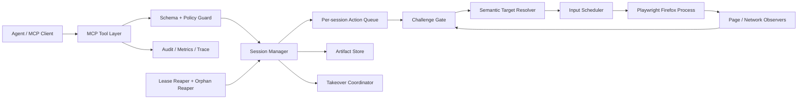

# 浏览器身份隔离与自动化 MCP：当前基线技术设计

> 当前产品包含本地 Profile 隔离 Studio 与策略约束 MCP。MCP 不公开 evaluate、写操作 raw selector 或原始协议；Studio 的确定性环境配置、代理池和 RPA 仍通过 SessionManager 高层动作与统一审计。

> 文档定位：这是资深技术视角的目标态/候选设计稿。其中 `browser_session_*`、虚拟显示和远程操作员身份认证等仍是后续演进方案。当前实现公开 40 个高层工具，已包含本地短期 handoff/takeover 租约、差分快照、声明式 workflow 和只读环境一致性诊断；实现差异与验证证据见 `docs/implementation-report.md`。

> 当前实现补充：`cluster_*` 已支持 Redis standalone/native Cluster、租户 + 分片路由、租户级 URL/任务/Worker 隔离，以及本地 stdio 控制面的可选 token/RBAC 认证；远程 MCP 网关认证仍按下文目标态设计执行。

> 文档状态：Draft v0.1  
> 面向读者：后端工程、浏览器自动化工程、测试、安全与运维  
> 仓库基线：本稿由技术设计阶段产出；实现结果另见交付报告  
> 设计边界：不设计或承诺 Cloudflare/CAPTCHA 绕过、检测通过率、账号不受限制或风控规避；确定性环境配置的目标是 Profile 内一致性，不是绕过授权边界

## 1. 目标与边界

### 1.1 目标

构建一个以版本锁定的 Playwright Firefox（Gecko）兼容构建为执行内核、以 MCP 暴露有限且可审计能力的浏览器自动化服务，满足：

- Agent 可以创建隔离会话、导航、读取页面语义快照、点击、输入、滚动、截图和关闭会话。
- 所有写操作均通过 Playwright 的高层语义接口或受控输入调度器执行，不暴露任意 JavaScript、CDP/BiDi、系统命令或浏览器内部调试接口。
- 提供可配置的“节奏化输入”：适用于演示、可用性测试和更自然的交互回放，但不根据站点风控信号自适应，也不用于伪装自动化。
- 一旦发现验证码、托管挑战页或疑似反自动化中间页，立即停止自动操作，并允许在支持的运行模式下由人类接管。
- 会话、工件、日志和资源有明确的生命周期、配额和清理机制。
- 工具契约稳定、错误可判定、操作可去重、行为可追踪。

### 1.2 当前版本暂不交付


- 不保证“通过 Cloudflare”或任何第三方机器人验证。
- 不自动点击验证码、不调用打码平台、不使用视觉模型解题，也不在挑战出现后自动刷新、重试或切换出口。
- 不定制浏览器内核、TLS 栈或根据站点检测结果动态改变环境配置。
- 不提供代理来源，不按风控信号自动轮换持久身份，也不克隆未经授权的真实用户配置目录。
- 不把页面初始化配置宣传为不可检测或可规避平台风控。
- 不提供 `evaluate`、任意 CSS/XPath 执行、原始协议命令、任意请求头、任意文件读写或下载后执行。
- 不把“鼠标曲线、随机停顿”宣传为降低风控或绕过检测的能力。

当业务要求与上述边界冲突时，应返回不支持，而不是新增隐蔽开关。

## 2. 核心设计原则

1. **语义优先**：Agent 先获取页面语义快照，再通过短期有效的元素引用进行操作；避免让模型拼装脚本或脆弱选择器。
2. **挑战即停**：挑战检测是状态机的强制门禁，不是提示信息。检测后所有自动写操作均失败关闭。
3. **最小能力**：MCP 只暴露完成常规网页交互所需的工具，不提供通用代码执行逃生口。
4. **隔离优先**：首版每个会话使用独立 Firefox 进程和临时用户目录，以资源成本换取故障与数据隔离。
5. **可重放而非伪装**：输入节奏可以用种子复现，便于测试；不会从线上站点反馈学习“更像人”的参数。
6. **默认短生命周期**：会话和工件按租约回收，服务崩溃后也有孤儿进程清理。
7. **服务端执行策略**：客户端不能放宽 URL、资源、挑战或审计策略。

## 3. 技术栈

### 3.1 建议选型

| 层 | 选型 | 原因 |
|---|---|---|
| 运行时 | Node.js 当前活跃 LTS | Playwright 与 MCP TypeScript 生态成熟；部署简单 |
| 语言 | TypeScript，`strict: true` | 工具输入、状态机与错误类型需要强约束 |
| 浏览器 | `playwright` 官方随附 Firefox | 使用受支持版本组合，避免自行拼装驱动与内核 |
| MCP | 官方 `@modelcontextprotocol/sdk` | 标准工具注册、stdio/HTTP 传输和内容类型 |
| 输入校验 | Zod，统一生成/维护 JSON Schema | 运行时校验和 TypeScript 类型同源 |
| 日志 | Pino 结构化日志 | 低开销、便于字段脱敏与采集 |
| 指标/追踪 | OpenTelemetry API + Prometheus exporter（可选启用） | 标准化 trace、metric，避免绑定单一平台 |
| 测试 | Vitest + Playwright fixture server | 单元与浏览器集成测试都在 TypeScript 内完成 |
| 代码质量 | ESLint + Prettier + TypeScript project references | 保持首版约束清晰 |
| 容器 | Linux OCI 镜像，固定 Playwright 与浏览器版本 | 版本可复现；生产可施加 cgroup/seccomp 限制 |

依赖版本应锁定在 lockfile，并由 Renovate/Dependabot 以测试通过为升级门槛。UA 与指纹版本从 Playwright 浏览器注册表生成；启动后核对实际内核版本。不得混用系统浏览器、跨引擎回退或在 CDP 外部浏览器上注入受管指纹。

Chromium 受管会话额外使用浏览器自己生成的回环 DevTools 端点，只自动挂接 `service_worker` 目标：新目标在网站代码执行前暂停，写入与页面相同的 UA metadata 和 Worker bootstrap 后恢复；挂接、注入或协议校验失败时关闭该浏览器上下文。该机制不适用于 Firefox，Firefox 的完整 Service Worker 指纹需要维护浏览器内核补丁。

### 3.2 MCP 传输

- **本地开发默认 `stdio`**：无监听端口，适合单用户 Agent。
- **服务化可选 Streamable HTTP**：必须置于已认证的网关后；服务端从认证上下文确定租户，禁止客户端自报 `tenantId`。
- 不在首版提供公网裸端口、SSE 兼容层或浏览器内嵌管理接口。

## 4. 总体架构



关键约束：

- 每个会话只有一个串行写操作队列；读取快照也要与导航建立一致性屏障。
- `Challenge Gate` 位于所有自动写操作之前，并由页面、frame、response、navigation 观察器异步触发。
- Playwright `Page`、`BrowserContext` 或元素句柄不会泄漏到 MCP 层。
- 元素引用是服务端生成的临时 token，不是选择器，也不能跨导航使用。

## 5. 运行模式与人工接管

### 5.1 当前运行模式

| 模式 | Firefox 启动方式 | 无实体显示器 | 人工接管 | 适用场景 |
|---|---|---:|---:|---|
| `headless` | 真正的 Firefox headless | 是 | 不支持同进程接管 | CI、无人值守的普通页面任务 |
| `headed_local` | 本机可见窗口 | 否 | 操作本机窗口 | Windows/macOS/Linux 本地开发 |

当前实现只提供 `headless` 与 `headed_local`。真正 headless 进程无法在运行中切换为 headed；服务器远程人工接管需要另行建设受保护的虚拟显示网关，当前版本不宣称支持。

### 5.2 人工接管协议

1. Agent 调用 `browser_takeover_request`，或挑战检测器自动将会话置为 `PAUSED_CHALLENGE`。
2. 服务取消未开始的自动操作，等待当前 Playwright调用结束或被 `AbortController` 中止，然后进入 `MANUAL_PENDING`。
3. `headed_local` 返回“请操作本机窗口”的状态；`headless` 返回 `TAKEOVER_UNAVAILABLE`。
4. 接管期间 MCP 只允许状态、只读截图、挑战状态、释放接管和关闭会话；自动点击/输入/导航全部拒绝。
5. 人工完成操作后调用 `browser_takeover_release`，并设置 `operatorConfirmed: true`。
6. 服务等待页面稳定，并连续一段观察窗口确认未再发现挑战；随后进入 `PAUSED_OPERATOR`，不会自动恢复。
7. Agent 必须显式调用 `browser_session_resume`。恢复前再次执行挑战门禁。

若未来增加远程接管，接管 URL 不得进入普通日志或被 MCP 客户端长期缓存；默认 60 秒过期、首次使用后作废。远程桌面网关必须仅转发该会话的虚拟显示，不提供 shell、剪贴板文件传输或主机桌面访问。

## 6. 会话生命周期

### 6.1 状态机

```text
CREATING
  -> READY
  -> FAILED

READY
  -> ACTION_RUNNING -> READY
  -> PAUSED_CHALLENGE
  -> MANUAL_PENDING -> MANUAL_ACTIVE
  -> PAUSED_OPERATOR
  -> CLOSING

ACTION_RUNNING
  -> READY
  -> PAUSED_CHALLENGE
  -> FAILED
  -> CLOSING

PAUSED_CHALLENGE
  -> MANUAL_PENDING -> MANUAL_ACTIVE
  -> CLOSING

MANUAL_ACTIVE
  -> PAUSED_OPERATOR
  -> PAUSED_CHALLENGE
  -> CLOSING

PAUSED_OPERATOR
  -> READY（仅显式 resume 且挑战检查通过）
  -> PAUSED_CHALLENGE
  -> CLOSING

CLOSING -> CLOSED
任意非终态 -> FAILED -> CLOSING -> CLOSED
```

状态转换由 `Session` 聚合根统一完成，工具实现不得直接赋值状态。每次转换记录 `from`、`to`、`reasonCode`、`traceId` 和单调递增的 `revision`。

### 6.2 创建

1. 校验全局与租户配额。
2. 生成不可预测的 `sessionId`，创建 0700 权限的临时目录。
3. 启动独立 Firefox 进程；生产环境放入独立进程组/Job Object 与资源控制单元。
4. 创建一个 context 和一个 page；首版最多一个活动 tab。
5. 注册 page/frame/response/dialog/download/crash 监听器。
6. 导航到 `about:blank`，状态转为 `READY`。

不得接受客户端提供的本地 profile 路径。需要登录态时只接受服务端密钥/工件仓库中的 `storageStateRef`，且必须与同一租户绑定、有过期时间、经业务授权；首版可以不实现该能力。

### 6.3 租约与回收

- 默认空闲租约 10 分钟，最大会话时长 60 分钟，均由服务端配置限制。
- 只有成功的工具请求或显式 heartbeat 更新空闲时间；排队等待不无限续租。
- 到期后进入 `CLOSING`：关闭 page/context/browser，终止进程组，关闭虚拟显示，清除临时 profile，最后删除过期工件。
- 正常关闭超时后先发送温和终止，再强制终止**已经按 session 记录并核验 PID/进程组的目标**；不得按进程名批量杀进程。
- 服务启动时读取自身会话登记表，核对父进程标记和目录 ownership 后清理孤儿；不扫描删除不属于本服务的 Firefox 或目录。

## 7. MCP 工具契约

### 7.1 通用约定

所有工具输入 `additionalProperties: false`。所有产生副作用的操作必须带：

```json
{
  "sessionId": "ses_...",
  "actionId": "客户端生成的 UUIDv4"
}
```

服务在会话生命周期内缓存 `actionId -> result`。同一 `actionId` 与相同参数重复提交返回原结果；参数不同返回 `ACTION_ID_CONFLICT`。这可以避免客户端超时重试导致二次点击或重复提交。当前公开实现将 `actionId` 作为兼容式可选字段，用于 `page_open`、`page_click`、`page_type`、`page_select` 和 `page_scroll`；缓存按会话限制为 256 项、TTL 10 分钟，并只保留 SHA-256 参数摘要和安全结果。相同工具同时支持可选 `expectedPageRevision` 前置校验。

统一成功返回：

```json
{
  "ok": true,
  "sessionId": "ses_...",
  "sessionState": "READY",
  "revision": 12,
  "traceId": "...",
  "data": {},
  "warnings": []
}
```

统一失败返回（MCP tool result 同时设置结构化错误；协议级异常只用于服务故障）：

```json
{
  "ok": false,
  "sessionId": "ses_...",
  "sessionState": "PAUSED_CHALLENGE",
  "traceId": "...",
  "error": {
    "code": "CHALLENGE_DETECTED",
    "message": "Automation paused because a challenge page was detected.",
    "retryable": false,
    "details": {}
  }
}
```

稳定错误码至少包括：`INVALID_INPUT`、`SESSION_NOT_FOUND`、`INVALID_STATE`、`ACTION_ID_CONFLICT`、`STALE_TARGET`、`TARGET_NOT_FOUND`、`TARGET_NOT_ACTIONABLE`、`NAVIGATION_BLOCKED`、`TIMEOUT`、`CHALLENGE_DETECTED`、`AUTOMATION_PAUSED`、`MANUAL_TAKEOVER_ACTIVE`、`TAKEOVER_UNAVAILABLE`、`RATE_LIMITED`、`RESOURCE_EXHAUSTED`、`BROWSER_CRASHED`、`INTERNAL_ERROR`。

### 7.2 工具清单与输入 Schema

以下为目标态候选工具，供后续扩展评审；其中命名可能不同于当前实现。当前实现公开 40 个工具，以 README、PRD 和实现报告为准。


#### `browser_session_create`

```json
{
  "type": "object",
  "additionalProperties": false,
  "properties": {
    "runtimeMode": {
      "type": "string",
      "enum": ["headless", "headed_local"],
      "default": "headless"
    },
    "viewport": {
      "type": "object",
      "additionalProperties": false,
      "properties": {
        "width": { "type": "integer", "minimum": 800, "maximum": 2560 },
        "height": { "type": "integer", "minimum": 600, "maximum": 1440 }
      },
      "required": ["width", "height"]
    },
    "inputProfile": {
      "type": "string",
      "enum": ["direct", "paced"],
      "default": "paced"
    },
    "seed": { "type": "integer", "minimum": 0, "maximum": 2147483647 },
    "idleTtlSeconds": { "type": "integer", "minimum": 60, "maximum": 1800 }
  }
}
```

`seed` 只用于测试可复现；没有提供时由服务生成并只在调试权限下返回。首版不接受 UA、代理、时区、语言、地理位置、扩展或 profile 参数。

#### `browser_session_status`

```json
{
  "type": "object",
  "additionalProperties": false,
  "properties": { "sessionId": { "type": "string", "minLength": 8 } },
  "required": ["sessionId"]
}
```

返回状态、租约剩余时间、当前 URL 的脱敏版本、页面标题、挑战状态、接管状态和资源摘要。

#### `browser_session_resume`

```json
{
  "type": "object",
  "additionalProperties": false,
  "properties": {
    "sessionId": { "type": "string" },
    "actionId": { "type": "string", "format": "uuid" },
    "operatorConfirmed": { "const": true }
  },
  "required": ["sessionId", "actionId", "operatorConfirmed"]
}
```

只允许从 `PAUSED_OPERATOR` 恢复。`PAUSED_CHALLENGE` 不能被 Agent 直接 resume。

#### `browser_session_close`

```json
{
  "type": "object",
  "additionalProperties": false,
  "properties": {
    "sessionId": { "type": "string" },
    "actionId": { "type": "string", "format": "uuid" },
    "reason": { "type": "string", "maxLength": 200 }
  },
  "required": ["sessionId", "actionId"]
}
```

关闭是幂等操作；已关闭会话返回最终清理摘要。

#### `browser_navigate`

```json
{
  "type": "object",
  "additionalProperties": false,
  "properties": {
    "sessionId": { "type": "string" },
    "actionId": { "type": "string", "format": "uuid" },
    "url": { "type": "string", "format": "uri", "maxLength": 2048 },
    "waitUntil": { "type": "string", "enum": ["domcontentloaded", "load"], "default": "domcontentloaded" },
    "timeoutMs": { "type": "integer", "minimum": 1000, "maximum": 60000 }
  },
  "required": ["sessionId", "actionId", "url"]
}
```

只允许策略许可的 `http`/`https`。每次重定向都重新执行 URL 策略；禁止 `file:`、`data:`、`javascript:`、`blob:` 作为顶层目标，以及 localhost、环回、链路本地、云元数据、私网和解析后落入受限网段的地址（除非测试环境显式 allowlist）。

#### `browser_snapshot`

```json
{
  "type": "object",
  "additionalProperties": false,
  "properties": {
    "sessionId": { "type": "string" },
    "mode": { "type": "string", "enum": ["interactive", "accessibility"], "default": "interactive" },
    "maxNodes": { "type": "integer", "minimum": 10, "maximum": 2000, "default": 500 },
    "includeText": { "type": "boolean", "default": true }
  },
  "required": ["sessionId"]
}
```

返回压缩语义树和可操作节点引用，例如 `ref: "r12_7"`。引用绑定 `sessionId + pageGeneration + frameId + nodeIdentity`，导航、frame 重载或 DOM 身份变化后失效。敏感输入值永不出现在快照中。

#### `browser_click`

```json
{
  "type": "object",
  "additionalProperties": false,
  "properties": {
    "sessionId": { "type": "string" },
    "actionId": { "type": "string", "format": "uuid" },
    "ref": { "type": "string", "maxLength": 100 },
    "button": { "type": "string", "enum": ["left"], "default": "left" },
    "timeoutMs": { "type": "integer", "minimum": 500, "maximum": 30000 }
  },
  "required": ["sessionId", "actionId", "ref"]
}
```

首版只允许单次左键。双击、右键、强制点击和坐标点击不公开，避免误操作和越过 actionability 检查。

#### `browser_hover`

```json
{
  "type": "object",
  "additionalProperties": false,
  "properties": {
    "sessionId": { "type": "string" },
    "actionId": { "type": "string", "format": "uuid" },
    "ref": { "type": "string", "maxLength": 100 },
    "timeoutMs": { "type": "integer", "minimum": 500, "maximum": 30000 }
  },
  "required": ["sessionId", "actionId", "ref"]
}
```

#### `browser_type`

```json
{
  "type": "object",
  "additionalProperties": false,
  "properties": {
    "sessionId": { "type": "string" },
    "actionId": { "type": "string", "format": "uuid" },
    "ref": { "type": "string", "maxLength": 100 },
    "text": { "type": "string", "maxLength": 10000 },
    "clearFirst": { "type": "boolean", "default": false },
    "submit": { "type": "boolean", "default": false },
    "sensitive": { "type": "boolean", "default": false },
    "timeoutMs": { "type": "integer", "minimum": 500, "maximum": 30000 }
  },
  "required": ["sessionId", "actionId", "ref", "text"]
}
```

`sensitive: true` 时文本不写日志、trace 或失败工件，内存中的 action 去重记录只保留参数 HMAC。默认逐字符使用键盘接口；不制造错别字、回删或其他伪装行为。`submit` 只在输入完成并再次通过挑战门禁后发送 Enter。

#### `browser_key`

```json
{
  "type": "object",
  "additionalProperties": false,
  "properties": {
    "sessionId": { "type": "string" },
    "actionId": { "type": "string", "format": "uuid" },
    "key": {
      "type": "string",
      "enum": ["Enter", "Tab", "Escape", "ArrowUp", "ArrowDown", "ArrowLeft", "ArrowRight", "PageUp", "PageDown", "Home", "End", "Backspace", "Delete"]
    }
  },
  "required": ["sessionId", "actionId", "key"]
}
```

不接受任意组合键字符串，避免触发浏览器/系统危险快捷键。

#### `browser_scroll`

```json
{
  "type": "object",
  "additionalProperties": false,
  "properties": {
    "sessionId": { "type": "string" },
    "actionId": { "type": "string", "format": "uuid" },
    "direction": { "type": "string", "enum": ["up", "down", "left", "right"] },
    "amount": { "type": "integer", "minimum": 1, "maximum": 3, "default": 1 },
    "ref": { "type": "string", "maxLength": 100 }
  },
  "required": ["sessionId", "actionId", "direction"]
}
```

`amount` 表示受服务端限制的视口比例档位，而不是任意像素值。

#### `browser_wait`

```json
{
  "type": "object",
  "additionalProperties": false,
  "properties": {
    "sessionId": { "type": "string" },
    "durationMs": { "type": "integer", "minimum": 50, "maximum": 10000 },
    "condition": {
      "type": "object",
      "additionalProperties": false,
      "properties": {
        "ref": { "type": "string" },
        "state": { "type": "string", "enum": ["visible", "hidden", "enabled"] }
      },
      "required": ["ref", "state"]
    },
    "timeoutMs": { "type": "integer", "minimum": 500, "maximum": 30000 }
  },
  "required": ["sessionId"],
  "oneOf": [
    { "required": ["durationMs"] },
    { "required": ["condition"] }
  ]
}
```

等待期间仍运行挑战检测与租约检查。

#### `browser_screenshot`

```json
{
  "type": "object",
  "additionalProperties": false,
  "properties": {
    "sessionId": { "type": "string" },
    "fullPage": { "type": "boolean", "default": false },
    "maskRefs": { "type": "array", "items": { "type": "string" }, "maxItems": 50 }
  },
  "required": ["sessionId"]
}
```

返回 MCP image content 或短时 `artifactRef`。默认遮罩 password 字段与标记为敏感的输入；单张尺寸、像素数与调用频率受限。

#### `browser_challenge_status`

```json
{
  "type": "object",
  "additionalProperties": false,
  "properties": { "sessionId": { "type": "string" } },
  "required": ["sessionId"]
}
```

只返回是否命中、信号类别、首次发现时间与人工接管可用性，不返回任何“如何绕过”的建议。

#### `browser_takeover_request`

```json
{
  "type": "object",
  "additionalProperties": false,
  "properties": {
    "sessionId": { "type": "string" },
    "actionId": { "type": "string", "format": "uuid" },
    "reason": { "type": "string", "maxLength": 200 }
  },
  "required": ["sessionId", "actionId", "reason"]
}
```

#### `browser_takeover_release`

```json
{
  "type": "object",
  "additionalProperties": false,
  "properties": {
    "sessionId": { "type": "string" },
    "actionId": { "type": "string", "format": "uuid" },
    "operatorConfirmed": { "const": true }
  },
  "required": ["sessionId", "actionId", "operatorConfirmed"]
}
```

### 7.3 有意不公开的工具

以下能力即使 Playwright 支持也不应注册为 MCP 工具：`page.evaluate`、`addInitScript`、route 修改请求、任意 locator/CSS/XPath、坐标点击、浏览器启动参数、原始 keyboard text/快捷键、任意下载路径、上传任意主机路径、代理设置、cookie 原文导出、持久化 profile 路径、扩展安装、权限批量授予、WebRTC/媒体设备伪造、CDP/BiDi 命令。

如后续业务确需文件上传，应单独设计“租户工件引用 -> 允许的 file input”流程，绝不能接受本机绝对路径。

## 8. 语义定位与页面快照

### 8.1 快照模型

`browser_snapshot(mode=interactive)` 只返回与操作相关的节点：role、accessible name、状态、简短文本、frame 层级和临时 `ref`。示例：

```text
[r18_1] button "保存" enabled
[r18_2] textbox "邮箱" required value=<redacted>
[r18_3] link "帮助" hrefOrigin=https://example.com
```

不返回完整 HTML、内联脚本、隐藏字段值或 password value。文本应有总字符上限，并标注截断。

### 8.2 引用解析

服务端 ref registry 保存弱引用和语义定位信息。执行前必须：

1. 校验会话、page generation 与 frame generation。
2. 重新解析为唯一元素；0 个返回 `TARGET_NOT_FOUND`，多于 1 个返回 `STALE_TARGET`。
3. 校验可见、稳定、未被遮挡、enabled，且仍具有与快照一致的关键语义。
4. 执行挑战门禁。

不使用 `force: true`。页面变化导致 ref 失效时，引导 Agent 重新 snapshot，而不是猜坐标。

## 9. 节奏化输入调度（非规避检测）

### 9.1 用途

`paced` profile 用于让交互回放更容易观察、降低 UI 动画与连续操作的竞态，并支持可重复的可用性测试。它不修改任何浏览器指纹，也不以欺骗第三方检测为目标。

### 9.2 调度规则

- 操作开始前等待一个有上下限的小间隔；默认区间由服务端配置，客户端不能超过安全边界。
- 指针移动到元素时使用若干受限中间点和固定上限时长，最终仍由 Playwright 对目标做 actionability 检查。
- 文本逐字符输入并使用有界间隔；不故意输入错误、不回删、不模拟疲劳或身份画像。
- 滚动分成有限小步，始终受最大总距离和超时约束。
- 所有随机数来自会话 PRNG；测试提供种子即可完整复现。
- 参数与站点、域名、HTTP 状态、挑战信号和历史成功率无关；线上遥测不得用于训练或调参以规避检测。
- 每个微步骤前检查 `AbortSignal` 和挑战状态；一旦暂停立即停止后续步骤。

建议的内部接口：

```ts
interface InputScheduler {
  pauseBefore(action: ActionKind, signal: AbortSignal): Promise<void>;
  movePointer(target: BoundingBox, signal: AbortSignal): Promise<void>;
  typeText(target: Locator, text: string, sensitive: boolean, signal: AbortSignal): Promise<void>;
  scroll(direction: Direction, amount: 1 | 2 | 3, signal: AbortSignal): Promise<void>;
}
```

`direct` profile 仍使用 Playwright 高层 locator 操作，但不加可视化节奏；它不是底层协议直通。

## 10. 挑战检测与强制暂停

### 10.1 信号源

检测器采用保守、提供商无关的信号组合：

- 主文档或 frame 出现经安全团队维护的挑战组件特征。
- 页面标题、可访问文本和页面结构同时呈现“验证访问者/安全检查/验证码”等挑战语义。
- 导航或 response 出现挑战类状态（例如 403/429）并伴随中间页结构。
- 人工或上游策略显式标记当前页面为挑战。

具体签名放在只读配置中，带版本和测试用例。单独的 403/429 不足以判定挑战；应通过组合信号减少误报。检测器只识别和暂停，不操作挑战组件。

### 10.2 原子暂停流程

1. 观察器产生 `ChallengeSignal`。
2. 会话互斥区内合并信号并计算结论。
3. 命中后原子转为 `PAUSED_CHALLENGE`，增加 revision。
4. 触发会话级 `AbortController`，取消队列和可中止的进行中动作。
5. 记录脱敏证据：信号类型、URL origin、状态码、时间；可按策略保存遮罩截图。
6. 后续自动写工具统一返回 `CHALLENGE_DETECTED`，不自动重试。
7. 只有 `status`、`snapshot`（可按策略只读）、`screenshot`、`challenge_status`、`takeover_request`、`takeover_release` 和 `session_close` 可用。

导航与挑战观察存在竞态，因此每个写动作都要执行“排队前、取得锁后、实际动作前”三次门禁；导航完成和 frame attach 也必须触发扫描。无法承诺中止已经由浏览器提交的单个原子事件，但可以保证不再发出后续事件。

### 10.3 恢复条件

- Agent 不能宣告挑战已解决。
- 必须经过人工接管并由操作者确认释放。
- 检测器在稳定窗口内无挑战信号后进入 `PAUSED_OPERATOR`。
- 再由显式 `browser_session_resume` 恢复自动化；恢复动作本身被审计。
- 如果挑战再次出现，立即回到 `PAUSED_CHALLENGE`，不设自动重试次数。

## 11. 安全与数据治理

### 11.1 网络策略

- URL allowlist/denylist 在服务端配置；DNS 解析前后都检查，重定向逐跳检查，防止 DNS rebinding 和 SSRF。
- 生产默认阻止环回、RFC1918、链路本地、IPv6 本地地址、云元数据地址和非 HTTP(S) 协议。
- 下载默认取消；弹窗默认拒绝并记录；新 tab 默认关闭或转为受控单 tab 流程。
- 页面发起的请求可以访问其正常子资源，但通过容器网络策略阻止内网和元数据服务，不能只依赖应用层检查。

### 11.2 秘密与敏感内容

- 工具输入、页面文本、URL query、cookie、Authorization、表单值默认不进入日志。
- URL 日志默认仅保留 scheme、host 和 path 模板；query/fragment 删除。
- `sensitive: true` 的文本仅在操作内存中短暂存在，并在去重记录中保存 HMAC 而非原文。
- 截图、trace、视频默认关闭；启用时必须配置租户保留期、访问控制和加密。
- Playwright trace 不得在生产无条件开启，因为它可能包含 DOM、请求和截图。

### 11.3 进程与文件隔离

- 非 root 用户运行；临时 profile 与工件目录权限最小化。
- 容器限制 CPU、内存、PID、文件描述符和出站网络。
- Firefox 崩溃文件、下载和缓存都写入该会话目录，关闭时定向清理。
- 不挂载宿主用户目录、SSH 凭据、浏览器 profile 或 Docker socket。

## 12. 并发、背压与资源回收

### 12.1 并发模型

- 首版：一个 session 对应一个 Firefox 进程、一个 context、一个活动 page。
- 全局进程信号量 + 每租户信号量；默认值由压测确定，不写死在 SDK。
- 每会话写操作串行，队列默认最大 32；满时返回 `RESOURCE_EXHAUSTED`。
- 快照/截图需要取得读屏障；导航和 DOM generation 变化时不能返回混合版本。
- MCP 请求有硬超时；超时只取消本次动作，不直接复用未知状态，先重新检查页面和 session 状态。

### 12.2 资源预算

每会话记录并限制：

- 进程 RSS、CPU 时间、打开文件数。
- 会话累计网络字节数与单响应大小（可在基础设施层限制）。
- 快照节点数/字符数、截图像素数、工件总字节数。
- 每分钟工具调用数、导航数和截图数。
- 生命周期总时长和空闲时长。

达到软阈值先告警；达到硬阈值转 `CLOSING` 并返回清晰错误。不得通过悄悄降低挑战检测或隔离来换取吞吐。

## 13. 可观测性

### 13.1 日志

结构化字段建议：

```text
timestamp, level, serviceVersion, browserRevision,
tenantHash, sessionId, actionId, toolName, traceId,
stateBefore, stateAfter, durationMs, resultCode,
urlOriginHash, challengeState, resourceSummary
```

禁止字段：输入文本原文、cookie、header、完整 URL query、页面全文、接管 URL、截图 base64、storage state。

### 13.2 指标

- `browser_sessions_active{mode,state}`
- `browser_session_create_total{result}` / `browser_session_create_duration_seconds`
- `browser_tool_calls_total{tool,result}` / `browser_tool_duration_seconds{tool}`
- `browser_action_queue_depth`
- `browser_challenge_detected_total{signal_family}`
- `browser_takeover_total{mode,result}`
- `browser_process_crash_total`
- `browser_reaper_cleanup_total{reason,result}`
- `browser_artifact_bytes`
- `browser_resource_limit_total{resource}`

标签不得包含原始 URL、sessionId、actionId 或用户输入，以免高基数和泄密。

### 13.3 Trace 与审计

一个 MCP 调用对应一个 span；内部子 span 覆盖 queue wait、policy check、challenge gate、target resolve、paced input 和 browser wait。审计记录与调试日志分离并防篡改，重点记录会话创建/关闭、导航 origin、挑战暂停、人工接管、恢复与策略拒绝。

## 14. 推荐目录结构

```text
.
├─ docs/
│  └─ technical-design.md
├─ src/
│  ├─ index.ts
│  ├─ config/
│  │  ├─ schema.ts
│  │  └─ load-config.ts
│  ├─ mcp/
│  │  ├─ server.ts
│  │  ├─ response.ts
│  │  └─ tools/
│  │     ├─ session-tools.ts
│  │     ├─ navigation-tools.ts
│  │     ├─ interaction-tools.ts
│  │     ├─ observation-tools.ts
│  │     └─ takeover-tools.ts
│  ├─ domain/
│  │  ├─ session.ts
│  │  ├─ session-state.ts
│  │  ├─ errors.ts
│  │  └─ action-deduplicator.ts
│  ├─ browser/
│  │  ├─ firefox-launcher.ts
│  │  ├─ browser-session.ts
│  │  ├─ semantic-snapshot.ts
│  │  ├─ target-registry.ts
│  │  └─ page-observers.ts
│  ├─ input/
│  │  ├─ scheduler.ts
│  │  ├─ direct-scheduler.ts
│  │  ├─ paced-scheduler.ts
│  │  └─ seeded-rng.ts
│  ├─ challenge/
│  │  ├─ detector.ts
│  │  ├─ signal.ts
│  │  ├─ policy.ts
│  │  └─ signatures.ts
│  ├─ takeover/
│  │  ├─ coordinator.ts
│  │  ├─ local-takeover.ts
│  │  └─ virtual-display-takeover.ts
│  ├─ policy/
│  │  ├─ url-policy.ts
│  │  ├─ dns-guard.ts
│  │  └─ quota-policy.ts
│  ├─ artifacts/
│  │  ├─ artifact-store.ts
│  │  └─ redaction.ts
│  ├─ lifecycle/
│  │  ├─ session-manager.ts
│  │  ├─ lease-reaper.ts
│  │  └─ orphan-reaper.ts
│  └─ observability/
│     ├─ logger.ts
│     ├─ metrics.ts
│     ├─ tracing.ts
│     └─ audit.ts
├─ tests/
│  ├─ unit/
│  ├─ integration/
│  ├─ security/
│  ├─ load/
│  └─ fixtures/
│     └─ pages/
├─ package.json
├─ tsconfig.json
├─ eslint.config.js
└─ playwright.config.ts
```

模块名称不是安全边界。环境配置、代理轮换等实现必须保持在服务端受校验模型内，不得因此开放 raw protocol、任意脚本、挑战求解或按风控信号自适应的隐藏开关。

## 15. 测试矩阵

### 15.1 单元测试

| 范围 | 必测项 |
|---|---|
| Schema | 缺字段、额外字段、边界值、超长文本、非法 enum、UUID 格式 |
| 状态机 | 所有合法转换；非法转换拒绝；revision 单调递增 |
| 去重 | 相同 actionId 同参复用、异参冲突、敏感参数不落原文 |
| URL 策略 | 协议、IPv4/IPv6、私网、环回、元数据地址、重定向、DNS rebinding |
| Target registry | 跨导航失效、frame 重载失效、歧义元素拒绝、敏感值遮罩 |
| Input scheduler | 种子可复现、延时/步数有界、AbortSignal 立即停止、无站点自适应 |
| Challenge detector | 单信号不误判、组合命中、信号去重、暂停幂等 |
| Reaper | 正常关闭、超时升级、只清理登记 PID/目录、重启孤儿回收 |
| Redaction | URL、headers、表单、日志、trace 与 screenshot 策略 |

### 15.2 浏览器集成测试

使用本地 fixture server 和 Playwright 官方 Firefox，覆盖：

- 创建/关闭会话及进程、profile、临时目录回收。
- 导航、重定向逐跳策略、页面崩溃和超时。
- 语义快照、ref 点击、输入、滚动、ref 过期和遮挡元素拒绝。
- 动态 DOM、iframe、SPA navigation、dialog、popup 和 download 默认策略。
- 人工构造挑战 fixture：导航中出现、动作中出现、iframe 延迟出现；验证队列停止且不触碰挑战组件。
- `paced` profile 在相同 seed 下事件序列可复现，且取消后没有尾随输入。
- 真 headless 返回 `TAKEOVER_UNAVAILABLE`；headed/virtual display 按状态机接管与释放。
- 敏感输入不会出现在日志、错误、快照、去重缓存或默认工件中。

挑战测试使用自有 fixture，不对真实 Cloudflare/CAPTCHA 页面进行自动求解或“通过率”测试。若授权的端到端环境遇到第三方挑战，唯一合格结果是自动暂停。

### 15.3 安全测试

- SSRF：十进制/八进制 IP、IPv4-mapped IPv6、CNAME、重定向、DNS rebinding、userinfo 混淆。
- MCP fuzz：深层 JSON、超大数组、Unicode、原型污染字段、并发重复 actionId。
- 路径安全：工件引用伪造、目录穿越、符号链接、跨租户引用。
- 资源耗尽：无限页面、巨幅 canvas、下载、弹窗、导航循环、截图洪泛。
- 接管：token 过期、重放、跨租户、日志泄漏、会话关闭后访问。
- 故障注入：Firefox kill、MCP 断连、服务重启、磁盘满、工件仓库不可用。

### 15.4 兼容与负载测试

- Linux 容器 headless 与 virtual display 是生产主矩阵；Windows `headed_local` 是开发矩阵。
- 每次升级 Playwright 都运行完整矩阵，并记录 Firefox revision。
- 用逐步加压确定单机并发上限，观察 P95 工具延迟、会话创建时间、RSS、CPU、崩溃率和清理成功率。
- 验收容量以部署目标为准；在没有基准硬件前不承诺固定并发数。

## 16. 开发任务拆解

### Phase 0：安全契约与脚手架

1. 初始化 Node/TypeScript、锁文件、lint/test/build。
2. 建立工具输入 Zod schema、统一响应与错误码。
3. 将“不提供的能力”写为架构测试：注册工具列表必须精确匹配 allowlist。
4. 建立配置 schema，所有安全边界均有服务端硬上限。

**验收**：`typecheck`、unit test 通过；MCP `tools/list` 无 evaluate、写操作 raw selector、raw protocol 或验证码工具；代理与环境配置只能出现在受限启动 schema 中，只读抽取 selector 受 schema 约束。

### Phase 1：Firefox 会话与生命周期

1. 实现独立进程 launcher、临时 profile、Session 状态机。
2. 实现 manager、租约、关闭升级、孤儿回收。
3. 注册 crash/dialog/popup/download 观察器与默认安全处理。
4. 实现 create/status/close。

**验收**：反复创建关闭 100 次后无遗留 Firefox、虚拟显示或 profile；kill/超时场景可收敛到 CLOSED；不会误杀非本服务进程。

### Phase 2：网络策略与导航

1. 实现 scheme/host/IP/DNS/redirect 策略。
2. 实现 `browser_navigate` 和单 tab generation 管理。
3. 容器层增加内网/元数据出站限制。

**验收**：SSRF 测试集全部拒绝；允许页面正常导航；重定向到受限地址在到达前中止并审计。

### Phase 3：语义快照与受控交互

1. 实现 accessibility/interactive snapshot 与文本裁剪。
2. 实现 target registry、ref 版本和 actionability 检查。
3. 实现 click/hover/type/key/scroll/wait/screenshot。
4. 实现 actionId 去重与敏感参数处理。

**验收**：Agent 只凭 snapshot ref 可完成自有 fixture 的表单流程；DOM/导航变化返回 stale 而不误点；敏感输入无日志泄漏。

### Phase 4：节奏化输入

1. 实现 seeded PRNG、direct/paced scheduler。
2. 对等待、移动、输入和滚动设服务端上下限。
3. 所有微步骤接入 AbortSignal。
4. 加入“不按域名/挑战/成功率调参”的代码与配置审查规则。

**验收**：同 seed 事件序列一致；所有时延与步数在边界内；任意时刻 abort 后不再产生后续输入；无指纹或 stealth 代码。

### Phase 5：挑战门禁

1. 实现组合信号、观察器、去重和审计。
2. 在所有写路径接入三阶段门禁。
3. 命中后原子暂停、取消队列并限制工具 allowlist。
4. 构建自有挑战 fixture，不实现解题流程。

**验收**：挑战在导航前后、输入中和 iframe 中出现时，系统均在可观测的最早边界停止；不自动点击、刷新、重试或切换环境；仅人工流程可推进。

### Phase 6：人工接管

1. 实现 headed local coordinator。
2. 生产需要时实现隔离 virtual display 与独立接管网关。
3. 实现一次性 token、认证绑定、过期、释放与显式 resume。
4. 验证接管期间自动工具全部锁止。

**验收**：跨租户/重放 token 失败；接管 URL 不进日志；operator release 后仍保持 paused，直到显式 resume；真 headless 明确返回不支持。

### Phase 7：可观测性与生产加固

1. 加入脱敏日志、metric、trace 和独立审计。
2. 加入租户/全局配额、队列背压、资源监控。
3. 构建固定版本镜像和最小权限运行配置。
4. 完成故障注入、负载测试和升级回滚说明。

**验收**：仪表盘可定位创建失败、动作延迟、挑战暂停、崩溃和清理失败；日志抽检无敏感内容；资源达到硬上限时会话可控关闭。

## 17. 发布验收标准

首版可以发布的最低条件：

1. 使用 Playwright 官方 Firefox，版本锁定且 SBOM 可生成。
2. MCP 工具严格匹配本文 allowlist，无任意代码/协议/选择器逃生口。
3. 自有普通页面 fixture 的关键流程成功率达到团队设定 SLO，错误码稳定可判定。
4. 任意挑战 fixture 命中后，自动写操作 100% 被锁止；没有自动求解、重试、刷新或环境切换。
5. `headless` 与 `headed_local` 的能力差异在工具返回和用户文档中清楚说明；未实现的远程虚拟显示不进入当前公开契约。
6. ref 跨导航/DOM generation 不复用，不允许 force click。
7. 会话关闭、过期、崩溃和服务重启后均无持续遗留进程或临时 profile。
8. SSRF、跨租户工件、接管 token 重放、敏感日志测试通过。
9. 资源配额、背压、超时和熔断均有自动化测试。
10. 文档不声称可规避站点风控；遇到第三方挑战的标准结果是暂停并请求人工处理。

## 18. 主要风险与取舍

| 风险 | 影响 | 处理 |
|---|---|---|
| Playwright Firefox headless 被站点拒绝 | 自动任务无法继续 | 不绕过；返回明确状态，必要时由业务改用获授权 API 或人工流程 |
| 真 headless 无法同进程人工接管 | 挑战时无法操作 | 当前版本返回不可接管状态；远程虚拟显示作为后续独立能力评审 |
| 挑战误报 | 正常流程被暂停 | 使用组合信号、版本化 fixture、人工释放；宁可安全暂停，不自动忽略 |
| 挑战漏报或竞态 | 可能多发出一个原子事件 | 多阶段门禁、异步观察、串行队列、AbortSignal；持续补充回归用例 |
| 一进程一会话资源较高 | 单机吞吐受限 | 首版优先隔离；用容量测试扩容，不提前改成跨租户进程池 |
| 语义 ref 对复杂前端不稳定 | Agent 需重复 snapshot | generation 与 stale 错误显式化；不退回坐标点击或 force click |
| 日志/截图包含敏感数据 | 合规与安全事件 | 默认关闭高风险工件、遮罩、短保留期、独立授权和持续泄漏测试 |
| 节奏化输入被误解为反检测 | 产品和合规风险 | 文档、命名、代码评审均限定为测试回放；禁止站点自适应和隐蔽参数 |

## 19. 待 PM/安全确认的决策

开发开始前应明确：

- 生产是否确实需要人工接管；若需要，是否单独建设虚拟显示网关及其运维隔离，不把它当作当前版本能力。
- 允许访问的域名/业务场景，以及是否必须默认 deny 私网和未知域名。
- 会话、截图、审计的租户级保留期和数据分级。
- 目标并发、硬件基线和 SLO，避免凭空承诺容量。
- 登录态由谁提供、如何获授权；首版是否完全不支持 storage state。
- 哪些挑战信号由安全团队维护，以及误报的人工处置流程。

这些决策不会改变本文的硬边界：不绕过挑战、不伪造指纹、不实现 stealth。
